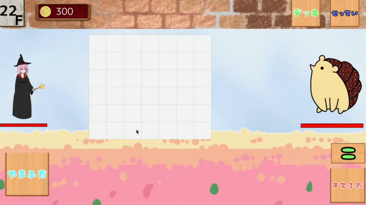
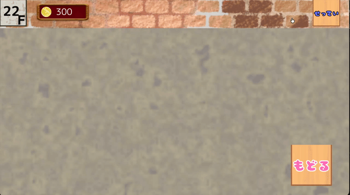

# Make10sion


Make10sionは，`Make10`というパズル要素を戦闘に取り入れたローグライクゲームである．

Make10 とは，数字(1~9)と四則演算子(+,-,x,÷)を組み合わせて`10`を作るパズルである．
この数字と演算子を組み合わせて目的の値を作るという要素を敵と戦う手段として取り入れた．
戦闘では，そのターンにおける敵の攻撃力・防御力を見ながら，
カード自体の`形状`や`回転`操作，配置する`位置`を考えて盤面上に数式を組み立てる．
配置によって攻撃・防御の割り当てや倍率が変わるため，同じ手札でも配置の仕方によって戦闘が大きく変化し得る．

繰り返しの戦闘による報酬や道中のショップなどのイベントを通じて，カードやレリックを獲得し，
デッキの選択肢や使用できる盤面が広がり，より複雑な数式を組み立てられるようになる．

## 画面構成

### 戦闘シーン



`やまふだ`から配られた手札を`盤面`に配置する．相手の攻撃力や防御力などを考慮し，カードの回転も駆使しながら数式を組み立てていく．
基本的に`上段`は攻撃力，`下段`は防御力として集計され，外側の行ほど`倍率`が高くなる．`特殊カード`によって行の役割や倍率の値を変更することもできる．
`=` を押すと盤面の状態が確定し，攻撃力・防御力に応じたダメージ処理が順に行われる．盤面に配置した手札や余った手札は`すてふだ`に移動する．

（GIF が表示されない場合は [こちら](docs/movies/battle-flow.mp4)）

### マップ


通常敵やボスとの対戦・ショップ・宝箱などから次のイベントを選択する．

### デッキ一覧



戦闘中に，所持しているデッキを確認できる．次のターンで，手札に来る可能性のあるカードを考慮し，今のターンの選択を考える材料となる．

(GIF が表示されない場合は [こちら](docs/movies/deck-view.mp4))

### ショップ


新しいカードやレリックを購入できる．限られた所持金を使って直近の戦闘を有利にするか，温存して後のより強力なデッキやレリックを購入するかを判断する．

<!-- ## 戦闘シーンの実装でこだわった点

- **自然なモーション**  
    山札から手札，手札から捨て札へデッキの移動や，カードを不正な位置へドロップした際の移動にイージング処理を行い，
    その動きにメリハリをつけた点．

- **カードの操作のしやすさ**  
    単純なカードのドラッグ&ドロップの操作に加え，一度置いたデッキも簡単に組み替えられるようにし，操作そのものではなく数式や配置を考えることに集中できるようにした．

- **計算に使われるデッキを見分けられる表示**  
  盤面上で数式の計算に使われていない数字・演算子は半透明にし，どのデッキが現在の結果へ影響しているかを視覚的に理解できるようにした．また，配置中にも各行の計算結果と倍率を表示し，デッキを動かしながら結果を確認できるようにしている．

- **攻防の流れを理解させる解決演出**  
  盤面で作った式が攻撃・防御の値になり，敵味方の HP へ反映されるまでを段階的に見せる．防御による軽減と HP へのダメージを順番に表示し，何が起きたかを追いやすくした．また，ダメージ量に応じてヒット演出の回数を変え，大きな攻撃ほど強く感じられるようにしつつ，演出が長くなりすぎないよう上限を設けている．

- **操作に反応する UI**  
  デッキや設定などの操作可能な UI は，ホバー時に表示を変化させることでクリック可能であることを伝える．戦闘中の数値やデッキの状態変化についても，小さな動きや表示変化を加えてフィードバックを返すようにしている． -->

## 開発体制

サークル内のハッカソンにて作成した．
お題が提示されてからのアイデア出しや，仕様を決めたり，役割分担などを考える期間が
約1週間あり，実装期間は 2日間であった．

制作メンバーは 7人で，主な役割分担は以下の通り．

- グラフィック: 1人
- サウンド: 1人
- プログラマ: 5人
    - デッキの操作・盤面の管理の実装: 2人
    - タイトル・マップ・ショップ・デッキ一覧・設定画面の実装: 2人
    - 戦闘シーンの実装: 1人（担当範囲）


<!-- ## ディレクトリ構成

```text
make10sion/
├── src/       # ゲーム本体の C++ コード
├── image/     # ゲーム内で使用する画像
├── audio/     # BGM・効果音
├── tests/     # デッキ操作・盤面計算などのテスト
├── windows/   # Visual Studio プロジェクトと Windows 用実行環境
└── macos/     # Xcode プロジェクトと macOS 用実行環境
``` -->
<!-- 
<details>
<summary><code>src/</code> の主な構成</summary>

```text
src/
├── Main.cpp                     # ゲーム起動・シーン管理
├── common.hpp                   # シーン間で共有するゲームデータ
│
├── Title.cpp / Title.hpp        # タイトル画面
├── Map.cpp / Map.hpp            # マップ画面
├── Battle.cpp / Battle.hpp      # 戦闘シーン全体
├── Shop.cpp / Shop.hpp          # ショップ
├── Event.cpp / Event.hpp        # イベント
├── Result.cpp / Result.hpp      # リザルト
│
├── Deck.cpp / Deck.hpp          # デッキ表示
├── Enemy.cpp / Enemy.hpp        # 敵データ
├── leric.cpp / leric.hpp        # レリック
├── HPBar.hpp                    # HP 表示
│
├── Block.cpp / Block.hpp        # デッキ形状・描画・回転
├── Board.cpp / Board.hpp        # 盤面状態の管理
├── Board_coordinate.cpp         # デッキ配置・ドラッグ・交換
├── Board_Calc.cpp               # 盤面上の計算結果をゲームへ反映
├── Board_draw.cpp               # 盤面描画
│
├── CardSymbolRules.hpp          # 数字・演算子・特殊デッキの定義
├── BoardCalculationRules.hpp    # 数式評価
├── BattleCardRules.hpp          # 戦闘中のデッキ操作ルール
├── BattleDamageRules.hpp        # ダメージ演出・分割ルール
├── BattleLayoutRules.hpp        # 戦闘画面の配置・レイアウト
├── EnemyIntentRules.hpp         # 敵の行動値に関するルール
├── GameStateRules.hpp           # ゲーム進行・デッキ状態
└── ShopRules.hpp                # ショップ関連ルール
```

</details> -->

## 開発環境とビルド

### macOS

OpenSiv3D(v0.6.16)の [macOS 用プロジェクトテンプレート](https://siv3d.github.io/ja-jp/download/macos/)を
ダウンロードし展開する．
Xcode 14.3 以降，Command Line Tools，Visual Studio Code が必要である．
Apple Silicon Mac では Rosetta 2 を使用して `x86_64` としてビルド・実行する．

テンプレートを展開後，このリポジトリが次の位置になるよう clone する．

```text
siv3d_v0.6.16_macOS/
├── include/
├── lib/
└── examples/
    └── make10sion/   # このリポジトリ
```

VS Code から実行する場合は，用途に応じて次のタスクを使用する．

- 通常通りゲームを最初から進める場合：`Build and Run on macOS`
- 戦闘システムやカードの操作感などをすぐに確認したい場合：`Run Demo Mode on macOS`

`Run Demo Mode on macOS` では，使用できる盤面が全て解放された状態から戦闘を開始できる．

その他，個別にビルド・実行したい場合は次のタスクを使用できる．

- `Build on macOS`
- `Run on macOS`

ターミナルから実行する場合は，このリポジトリのルートで次を実行する．

```bash
./macos/build-debug.sh
./macos/run-debug.sh
```

### Windows（動作未確認）

Windows での開発環境のセットアップについては，[Siv3D 公式の Windows 向け導入手順](https://siv3d.github.io/ja-jp/download/windows/)を参照する．

セットアップ後，`windows/make10sion.sln` を Visual Studio 2022 で開き，
`Debug | x64` または `Release | x64` を選択して実行する．