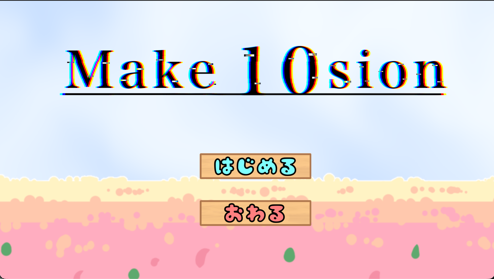
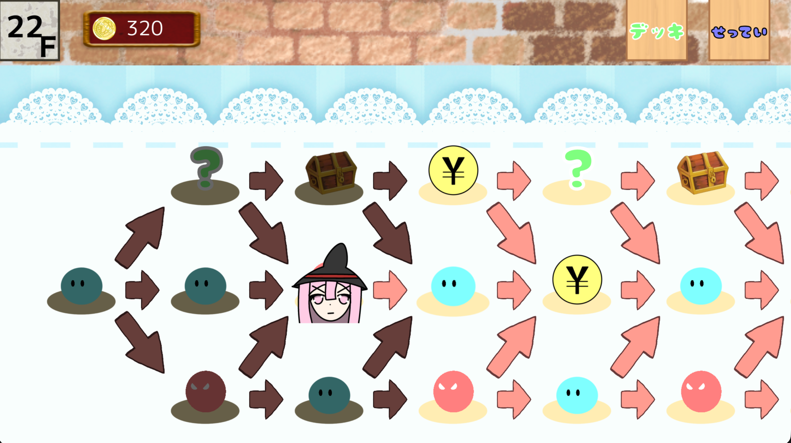
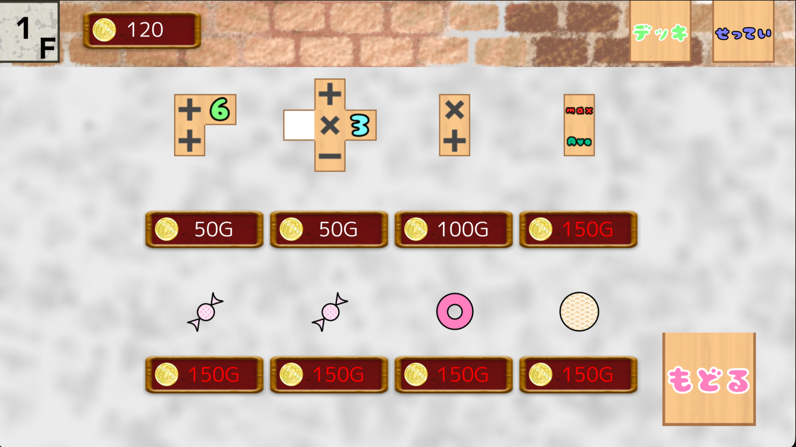

# make10sion / Arithmancer



メイクテンパズルの発想を二次元の盤面へ広げた、デッキ構築型の計算パズル・ローグライトです。数値・演算子カードを盤面に配置して数式を作り、攻撃と防御を組み立てながら敵を倒します。

一般的なメイクテンが一列の式を考えるパズルであるのに対し、本作ではカードの形状、配置する行、攻撃と防御の割り当てまでを同時に考えます。ショップやイベントでデッキと盤面を強化し、次の戦闘でより大きな式を作れるように進めます。

## 戦闘ティザー


手札の配布、カードの配置、`=` による攻防の解決、ターン終了までを表示しています。高画質版は [MP4](docs/movies/battle-flow.mp4) で確認できます。

## 画面構成

### 戦闘

手札のカードを 7 × 6 の盤面へドラッグし、横一列の数式を組み立てます。上段は攻撃、下段は防御として集計され、`=` を押すと敵と同時に解決します。

### マップ



敵・エリート・ショップ・イベント・宝箱・ボスから次の進行先を選びます。デッキを伸ばすか、盤面を解放するか、高いリスクの戦闘に進むかを判断する画面です。

### デッキ表示


戦闘中にも現在のデッキを確認できます。手札に来る可能性のある数値・演算子・特殊効果を把握し、盤面上の式と次のターンの選択を考えます。

### ショップ



カードとレリックを購入して、次の戦闘に向けてデッキを調整します。所持金、カードの役割、盤面との相性を同時に考える中長期的な判断ポイントです。

## こだわった点

- **カードがどこから来て、どこへ戻るかを自然に伝える動き** — 手札の配布、盤面への配置、使わなかったカードの回収、不正な位置へドロップした際の復帰にイージングを使い、カードの移動元と移動先を追いやすくしました。
- **操作に反応する UI** — デッキや攻撃アイコンなどは、ホバー時の拡大や数値変化時の小さな動きで、操作可能な要素と状態変化を伝えます。
- **計算に使われるカードを見分けられる表示** — 盤面上で数式の計算に使われないカードは半透明にし、どのカードが結果へ影響しているかを視覚的に理解できるようにしました。
- **攻防の流れを理解させる解決演出** — 盤面で作った式が攻撃・防御の値になり、敵味方の HP へ反映されるまでを段階的に見せます。初見でも何が起きたかを追えるよう、結果を急がせない表示時間を設けています。

## 開発体制

C++ と OpenSiv3D v0.6.16 を用いた 7 人チーム制作です。

- サウンド: 1 人
- アート: 1 人
- カード操作・盤面管理・計算: 2 人
- タイトル・マップ・ショップ・デッキ・設定画面: 2 人
- 戦闘シーン: 1 人（担当範囲）

私の主な実装範囲は、戦闘画面内のカード操作、盤面への配置、攻防計算の見せ方、アニメーション、UI 操作です。

## ディレクトリ構成

```text
make10sion/
├── src/       # タイトル、マップ、ショップ、戦闘、カード、盤面、計算処理
├── image/     # ゲーム内で使用する画像
├── audio/     # BGM・効果音
├── tests/     # カード操作と開発用スクリプトのテスト
├── windows/   # Visual Studio プロジェクトと Windows 用実行環境
└── macos/     # Xcode プロジェクトと macOS 用実行環境
```

## 開発環境とビルド

### macOS

OpenSiv3D v0.6.16 の [macOS 用プロジェクトテンプレート](https://siv3d.github.io/ja-jp/download/macos/)をダウンロードして展開してください。Xcode 14.3 以降、Command Line Tools、Visual Studio Code が必要です。Apple Silicon Mac では Rosetta 2 を使用して `x86_64` としてビルド・実行します。

テンプレートを展開後、このリポジトリが次の位置になるよう clone します。Xcode プロジェクトは、この相対位置から SDK の `include` と `lib` を参照します。

```text
siv3d_v0.6.16_macOS/
├── include/
├── lib/
└── examples/
    └── make10sion/   # このリポジトリ
```

VS Code では次のタスクを使えます。

- `Build on macOS`
- `Run on macOS`
- `Run Demo Mode on macOS`
- `Build and Run on macOS`

ターミナルから実行する場合は、リポジトリのルートで次を実行します。

```bash
./macos/build-debug.sh
./macos/run-debug.sh
```

`Run Demo Mode on macOS` は、中盤相当の戦闘状態から起動して、戦闘画面を確認するためのタスクです。

### Windows

Windows 版は現在、動作未確認です。

Visual Studio 2022 と OpenSiv3D v0.6.16 SDK を用意し、環境変数 `SIV3D_0_6_16` に SDK のルートフォルダを指定します。`windows/make10sion.sln` を開き、`Debug | x64` または `Release | x64` を選んで「ローカル Windows デバッガー」で実行します。
